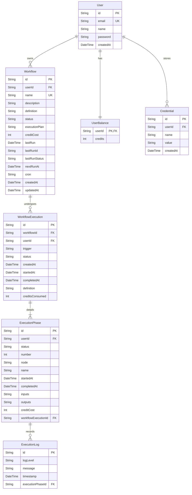

# FlowCraft - AI-Powered No-Code Web Scraping Automation Tool

Welcome to the official developer and system documentation for **FlowCraft**. This document is designed to provide engineers, administrators, and contributors with a comprehensive understanding of the system's architecture, database models, configuration settings, API design, security implementations, development workflow, and operational runbooks.

---

## Table of Contents
1. [Project Overview](#1-project-overview)
2. [Quick Start Guide](#2-quick-start-guide)
3. [Architecture & System Design](#3-architecture--system-design)
4. [Repository Structure](#4-repository-structure)
5. [Setup & Configuration](#5-setup--configuration)
6. [API Documentation](#6-api-documentation)
7. [Database Documentation](#7-database-documentation)
8. [Development Workflow](#8-development-workflow)
9. [Testing Documentation](#9-testing-documentation)
10. [Deployment Guide](#10-deployment-guide)
11. [Operational Runbooks](#11-operational-runbooks)
12. [Security Considerations](#12-security-considerations)
13. [Design Decisions (ADR)](#13-design-decisions-adr)

---

## 1. Project Overview

### What the Project Does
**FlowCraft** is an AI-powered visual no-code web scraping automation platform. It allows users to build, execute, and schedule complex web scraping workflows using an intuitive drag-and-drop node graph canvas. The platform executes browser interactions in real-time and enables extracting dynamic text or utilizing Google's Gemini AI to parse, interpret, and format unstructured web content.

### Why it Exists
Scraping modern web applications is notoriously fragile and complex. Websites rely heavily on JavaScript rendering, dynamic element classes, anti-scraping checks, and nested layout patterns. Developers spend excessive time updating CSS/XPath selectors and fixing broken scraping scripts. 

FlowCraft solves this problem by combining:
1. **A No-Code Editor**: Allowing product managers, analysts, and developers to visually choreograph browser flows without writing boilerplate Puppeteer code.
2. **AI-Enhanced Extraction**: Utilizing LLMs (Gemini v1.5 Flash) to dynamically locate, extract, and structure data based on plain-english prompts, making the extraction logic resilient to website layout updates.

### The Problem It Solves
- **Dynamic Content Scraping**: Solves JS-rendering scraping challenges through fully automated browser emulation using Puppeteer.
- **Fragile DOM Selectors**: Reduces selector-maintenance overhead by allowing LLM-powered semantic data extraction.
- **Scheduling & Orchestration**: Minimizes operational overhead of hosting, scheduling (via crons), running, and auditing scraping jobs.
- **Credential Safety**: Protects sensitive third-party API keys and logins using AES-256-CBC encryption in the database.

### Who it is For
- **Data Analysts & Marketers**: Gathering competitor pricing, lead intelligence, or product details without programming.
- **Developers**: Speeding up scraper prototyping or looking for an orchestrator to run scraping jobs at scale.
- **Enterprise Operations**: Automating data gathering workflows and sending structured JSON feeds straight to webhooks.

### Key Features
- **Visual Node Editor**: Powered by React Flow, featuring drag-and-drop node graphs with validation and dependency tracking.
- **Automated Interaction Blocks**: Nodes for Launching Browser, Navigation, Clicking, Input Filling, Waiting, and Scrolling.
- **AI Extract Node**: Seamlessly integrated with Gemini API to run context-aware, schema-validated JSON extractions.
- **Execution Log Visualizer**: Real-time phase-wise log output showing Puppeteer errors, credit costs, and phase run times.
- **Credit Balance System**: Onboarding grants users 250 trial credits, and actions/execution phases deduct credits based on resource complexity.
- **Webhook Integrations**: Delivery block to automatically post scraped JSON payloads to external APIs/endpoints.

---

## 2. Quick Start Guide

Follow these steps to set up FlowCraft on your local machine for development.

### Prerequisites
- **Node.js**: `v18.x` or later (tested on v20+)
- **npm**: `v9.x` or later
- **SQLite**: Local file database (no separate installation or setup required; managed via Prisma)

### Installation Steps

1. **Clone the Repository**:
   ```bash
   git clone <repository_url>
   cd AI-Powered-No-Code-Web-Scraping-Automation-tool
   ```

2. **Install Node Dependencies**:
   ```bash
   npm install
   ```

3. **Configure Environment Variables**:
   Copy the example environment configuration to create a local `.env` file:
   ```bash
   cp env.example .env
   ```
   Open the `.env` file and generate appropriate secret keys (see [Setup & Configuration](#5-setup--configuration) below).

4. **Initialize the Database**:
   Run Prisma migrations to create the local SQLite database schema and generate the client code:
   ```bash
   npx prisma db push
   ```

5. **Start Local Development Server**:
   ```bash
   npm run dev
   ```
   The application will be running locally at `http://localhost:3000`.

### Basic Usage Example
1. Sign up on the registration page (`http://localhost:3000/sign-up`). You will receive an initial credit balance of **250 credits**.
2. Navigate to the Credentials tab and add a new credential named `GEMINI_API_KEY` holding your Google Gemini API key.
3. Go to the Dashboard, click **Create Workflow**, and provide a title and description.
4. In the visual editor:
   - Drag a **Launch Browser** node (mandatory starting node).
   - Connect it to a **Navigate to URL** node, setting the URL to `https://news.ycombinator.com`.
   - Connect the page handle output to a **Page to HTML** node.
   - Connect the HTML string output to an **Extract Data with AI** node.
   - Configure the AI node to use your `GEMINI_API_KEY` credential, set the prompt to "Extract the top 5 stories with their title and points", and specify the property value to target.
5. Click **Run** in the header. Watch the phase executor run, view logs in real time, and inspect the final extracted JSON data.

---

## 3. Architecture & System Design

FlowCraft uses a modern React/Next.js stack utilizing Server Actions for CRUD operations and Next.js Route Handlers for background execution triggers.

### High-Level Architecture


> [!NOTE]
> For production deployment or offline builds, this architecture diagram is also stored at `/public/demo-assets/high-level-architecture.png` (or absolute path `/home/rishab/Personal/WebDev/AI-Powered-No-Code-Web-Scraping-Automation-tool/public/demo-assets/high-level-architecture.png`).

### Major Components

- **Frontend Client (Next.js App Router)**: Responsible for rendering pages under `src/app`. The dashboard displays billing credits, workflow statuses, and run logs. The visual editor utilizes `@xyflow/react` to render and interact with the workflow graph.
- **Workflow Engine & Executor**:
  - `FlowToExecutionPlan.ts`: Validates visual graph nodes, checking if entry points exist (e.g. `LAUNCH_BROWSER`), verifies connections are valid, and performs a topological sort to structure a sequential execution plan of phases.
  - `executeWorkflow.ts`: Resolves environment variables, reads the plan, updates database statuses, runs the nodes one-by-one, handles credit subtraction logic, and collects real-time logs.
  - `executor/`: Collection of individual task handlers. Each node type executes a specific action using Puppeteer (e.g., clicks, navigation) or external integrations (Gemini AI, HTTP webhook postings).
- **Security & Decryption Layer**: Standard AES-256-CBC encryption wraps credentials in the DB, only decrypting them in server memory during executor runs.
- **State Management**: Tanstack React Query manages client-side API requests, caching, and polling of active logs/executions.

### Data Flow for Workflow Execution
1. **Graph Topological Sorting**: When a run is triggered, the engine parses nodes/edges and generates an ordered list of execution phases.
2. **Phase Execution Cycle**:
   - The executor ensures the user has enough credits to pay for the node's predefined cost (e.g., 1 credit for Launch Browser, 10 credits for AI Extraction).
   - If credits are available, the user's credits are decremented in the DB. If not, the run fails immediately with `insufficient balance`.
   - The phase environment state (`Environment`) is passed from node to node. Outputs from parent nodes are mapped to inputs of child nodes using visual connection handles.
   - Logs generated during node execution are captured in-memory using `createLogCollector()` and flushed to the database at the end of the phase.
3. **Completion/Teardown**: Puppeteer browser sessions are closed in a `finally` block to prevent resource leaks, and the workflow run is marked as `COMPLETED` or `FAILED`.

---

## 4. Repository Structure

Here is an overview of FlowCraft's codebase structure:

```
├── prisma/
│   ├── schema.prisma                  # SQLite Database Schema Definitions
│   └── migrations/                    # Database migration history sql files
├── public/                            # Static assets and demo files
├── src/
│   ├── actions/                       # Next.js Server Actions (CRUD Operations)
│   │   ├── analytics/                 # Queries for dashboard metrics and statistics
│   │   ├── billing/                   # Credit balance queries and purchase shell
│   │   └── credentials/               # Credential creation, retrieval, deletion
│   │   └── workflows/                 # Workflow CRUD, run, publish, scheduler controls
│   ├── app/                           # Next.js App Router Pages & API Routes
│   │   ├── (auth)/                    # Sign-in & Sign-up pages
│   │   ├── (home)/                    # Main landing page
│   │   ├── (main)/                    # Protected routes (Dashboard, Credentials, Billing)
│   │   ├── api/                       # API route handlers
│   │   │   ├── auth/                  # Register, Login, and Logout endpoint controllers
│   │   │   └── workflows/             # Cron execution and trigger api endpoints
│   │   ├── types/                     # Shared TypeScript interfaces (Tasks, Workflows, Executor)
│   │   └── workflow/                  # Editor page, node controls, executions view
│   ├── components/                    # Reusable React & shadcn/ui components
│   │   ├── provider/                  # Providers (React Query, NextThemes)
│   │   └── ui/                        # Low-level UI design components (Card, Dialog, Table, etc.)
│   ├── hooks/                         # Reusable custom React hooks
│   ├── lib/                           # Core utilities, libraries and business logic
│   │   ├── auth.ts                    # JWT token signing/verification and password helpers
│   │   ├── encryption.ts              # AES-256-CBC symmetric credential cryptosystem
│   │   ├── log.ts                     # In-memory execution logs logger
│   │   ├── prisma.ts                  # Shared Prisma client instance
│   │   └── workflow/                  # Graph logic, execution engine and executor registry
│   │       ├── executor/              # Concrete action implementation files
│   │       └── task/                  # Visual node parameters configuration specs
│   ├── middleware.ts                  # Protected route auth enforcement middleware
│   └── schema/                        # Input verification schemas using Zod
```

### Purpose of Major Folders
- **`src/actions/`**: Replaces traditional HTTP APIs for React frontend forms. Handles workflows publishing, credential updates, dashboard metrics loading, etc.
- **`src/lib/workflow/executor/`**: Houses Puppeteer action handlers and API connectors. Adding a new feature (e.g. taking screenshots) involves creating a new executor here.
- **`src/lib/workflow/task/`**: Visual definition metadata of editor nodes. Configures required inputs, output types, labels, and credit cost.
- **`src/app/api/`**: Serves endpoints triggered by external applications or cron schedulers.
- **`src/lib/encryption.ts`**: Implements key security layer encrypting user-defined third-party credentials.

---

## 5. Setup & Configuration

FlowCraft uses environment variables loaded from a `.env` file at runtime. 

### Environment Variables Detail

| Variable | Description | Example Value | Production Considerations |
| :--- | :--- | :--- | :--- |
| `DATABASE_URL` | Prisma DB connection string. Points to the local SQLite database file. | `file:./dev.db` | If using serverless architectures, configure PostgreSQL instead. |
| `JWT_SECRET` | Secret key used to sign and verify user authentication cookies. | `your-secret-key-32-chars-or-more` | Must be a strong, cryptographically secure random string. |
| `ENCRYPTION_SECRET_KEY` | Hex-encoded key used for AES-256-CBC credential encryption. | `6fb81d8891... (64 hex characters)` | **Must be exactly 32 bytes (64 hex chars)**. If lost, all stored credentials become unreadable. |
| `API_SECRET` | Secret token used to authorize cron trigger requests to execute workflows. | `your-random-api-token-string` | A secure token passed in the header to authenticate automated executions. |
| `NEXT_PUBLIC_APP_URL` | Base URL of the web app, used to construct API callbacks and absolute URLs. | `http://localhost:3000` | Set this to your production domain name (e.g., `https://flowcraft.com`). |

---

## 6. API Documentation

FlowCraft exposes standard HTTP endpoints for authentication and cron-triggered execution control.

### 1. User Registration
Creates a new account and initializes a credit balance of 250 credits.
- **Endpoint**: `POST /api/auth/register`
- **Request Body**:
  ```json
  {
    "name": "John Doe",
    "email": "johndoe@example.com",
    "password": "securepassword123"
  }
  ```
- **Response (201 Created)**:
  ```json
  {
    "success": true
  }
  ```
- **Error Codes**: `400 Bad Request` (invalid input), `409 Conflict` (email already exists), `500 Internal Server Error`.

---

### 2. User Login
Validates credentials and sets a JWT cookie named `session`.
- **Endpoint**: `POST /api/auth/login`
- **Request Body**:
  ```json
  {
    "email": "johndoe@example.com",
    "password": "securepassword123"
  }
  ```
- **Response (200 OK)**:
  ```json
  {
    "success": true
  }
  ```
- **Error Codes**: `400 Bad Request` (invalid input), `401 Unauthorized` (incorrect credentials).

---

### 3. Trigger Cron Evaluations
Scans published workflows configured with cron properties and schedules tasks that have hit their execution thresholds.
- **Endpoint**: `GET /api/workflows/cron`
- **Headers**:
  ```http
  Authorization: Bearer <API_SECRET>
  ```
- **Response (200 OK)**:
  ```json
  {
    "workflowsToRun": 3
  }
  ```
- **Error Codes**: `401 Unauthorized` (missing/invalid secret).

---

### 4. Direct Workflow Execution
Triggers the execution of a specified workflow immediately in the background.
- **Endpoint**: `GET /api/workflows/execute`
- **Query Parameters**:
  - `workflowId` (string, required): The ID of the workflow to execute.
- **Headers**:
  ```http
  Authorization: Bearer <API_SECRET>
  ```
- **Response (200 OK)**: Empty body (execution runs in the background).
- **Error Codes**: `400 Bad Request` (missing/invalid parameters), `401 Unauthorized` (missing/invalid secret).

---

## 7. Database Documentation

FlowCraft uses Prisma ORM with SQLite for local execution.

### Database ER Diagram



### Important Tables
1. **User**: Stores hashed credentials and metadata.
2. **UserBalance**: Track available credits for run execution costs.
3. **Workflow**: Holds user-created visual canvas configuration schemas (nodes, connections, schedules, status).
4. **WorkflowExecution**: Audit table tracking status (`RUNNING`, `COMPLETED`, `FAILED`) and timestamps of individual workflow runs.
5. **ExecutionPhase**: Step-by-step phases corresponding to node-level items during execution.
6. **ExecutionLog**: Real-time error, warning, and details output associated with a specific phase runtime.
7. **Credential**: Encrypted third-party credentials (like `GEMINI_API_KEY`) used during visual flows.

### Migration Strategy
Migrations are managed standard via Prisma:
- Local changes are recorded using `npx prisma migrate dev`.
- Production schemas are enforced using `npx prisma migrate deploy` inside CI pipelines.

---

## 8. Development Workflow

We follow standard git workflows to ensure stability of the visual engine.

### Branching Strategy
- **`main`**: The stable branch mapping to production code. Directly protected.
- **`develop`**: Integration branch for pre-release features.
- **`feature/*`**: Individual developer feature branches branched off `develop`. Example: `feature/screenshot-node`.

### Commit Conventions
Commits must be readable and summarize changes clearly. Use the conventional commit pattern:
- `feat(nodes)`: Added scroll-to-element block.
- `fix(executor)`: Fixed browser cleanup on phase crash.
- `docs(api)`: Updated cron query specs.

### Pull Request & Review Process
1. Create a pull request from `feature/*` into `develop`.
2. Ensure there are no merge conflicts and that the typescript build compiles (`npm run build`).
3. Have at least one reviewer verify changes. Look closely for Puppeteer connection cleanup leaks or unhandled Prisma transaction errors.

---

## 9. Testing Documentation

### Current State
FlowCraft currently does not have an automated testing framework (Jest, Playwright) configured. The current validation process relies on:
1. **TypeScript Compilation**: Ensuring the type declarations are valid via `npm run build`.
2. **Manual verification**: Creating test workflows on the canvas editor and running them.

### Future Testing Strategy

```
Unit Tests (Jest)             # For logic helpers like FlowToExecutionPlan
      ↓
Integration Tests (Supertest) # For Route Handlers (/api/workflows/execute)
      ↓
End-to-End Tests (Playwright) # For UI editor drag-and-drop & mock browser runs
```

- **Unit Testing**: It is recommended to use **Jest** to test the graph validation algorithm in `src/lib/workflow/FlowToExecutionPlan.ts` with mock visual nodes and edges (specifically validating cycle detection and missing entry nodes).
- **E2E Testing**: Recommend installing **Playwright** to visually verify page flows, mock clerk/user logins, and assert node-connection behavior.

---

## 10. Deployment Guide

### SQLite Considerations in Production
> [!WARNING]
> SQLite is a file-based database. Modern cloud servers (like Vercel, Heroku) operate on stateless, ephemeral filesystems. Any local database files (`dev.db`) will be deleted whenever the application restarts or redeploys.

If deploying to a serverless platform like Vercel:
1. **Database Adaption**: Change the database provider in `prisma/schema.prisma` from `sqlite` to `postgresql` or `mysql` and reference a hosted service (like Neon, Supabase, or AWS RDS).
2. **Migration Sync**: Run `npx prisma db push` or apply migration logs to direct migrations to the external database server.

If deploying to a VPS (e.g. AWS EC2, DigitalOcean Droplet, Render persistent volumes):
1. Keep SQLite if using Docker volumes or configuring persistent filesystem mapping.
2. Initialize migration scripts before starting up the Next.js process:
   ```bash
   npx prisma migrate deploy
   npm run build
   npm run start
   ```

### CI/CD Pipeline Flow (Example)
1. **Push to `main`**: Triggers pipeline (e.g. GitHub Actions).
2. **Linter & Build**: Run `npm run lint` and `npm run build` to verify code compiles.
3. **Migrate**: Execute `npx prisma db push` / `npx prisma migrate deploy` targeting production environments.
4. **Deploy**: Push build artifacts to server/service.

---

## 11. Operational Runbooks

### Runbook 1: User Workflow is Stuck in "RUNNING"
- **Symptom**: Workflow execution doesn't complete, and dashboard indicates active execution status indefinitely.
- **Root Cause**: Often caused by Puppeteer instances timing out waiting for DOM selectors on pages, or Next.js background promises crashing before writing final status details.
- **Resolution**:
  1. Inspect logs inside the `ExecutionLog` and `ExecutionPhase` tables for the specific `executionId`.
  2. If the browser crashed, check if the system memory is exhausted (Puppeteer is resource-heavy).
  3. Force set the execution status to `FAILED` in the database to release locks:
     ```sql
     UPDATE "WorkflowExecution" SET "status" = 'FAILED', "completedAt" = CURRENT_TIMESTAMP WHERE "id" = 'STUCK_EXECUTION_ID';
     ```

### Runbook 2: Node Executions Fail with "Insufficient Balance"
- **Symptom**: User visual runs abort immediately inside first phases.
- **Resolution**:
  1. Verify user credits in `UserBalance` table.
  2. If credits are 0, user must buy credits or an administrator can manually add promotional credits:
     ```sql
     UPDATE "UserBalance" SET "credits" = "credits" + 500 WHERE "userId" = 'USER_ID';
     ```

### Runbook 3: Scrapers Break Due to "Selector Timeout"
- **Symptom**: Workflows that were working perfectly begin failing at `ClickElement` or `ExtractTextFromElement` nodes.
- **Root Cause**: The targeted website changed its DOM layout, ID/class names, or structure.
- **Resolution**:
  1. Open the website manually and inspect target HTML selectors.
  2. Update the target selector in the visual node canvas.
  3. Propose using the **Extract Data with AI** node instead. The Gemini model handles layout parsing semantically and is highly resilient to website markup changes.

---

## 12. Security Considerations

FlowCraft prioritizes data privacy and credential safety.

- **Authentication System**:
  - Uses standard, cryptographically signed HTTP cookies.
  - JWT Tokens expire in 7 days and are signed using HS256 (`jose`).
  - Cookies use `httpOnly`, `secure: true` (in production), and `sameSite: "lax"` properties to prevent XSS and CSRF token interception.
- **Password Safety**:
  - User passwords are obfuscated and hashed using `bcryptjs` with a work factor of `12` before SQL storage.
- **Credential Storage (AES-256-CBC)**:
  - Stored API credentials (e.g. Gemini key) are encrypted with symmetric AES-256-CBC.
  - Encryption and decryption require the secret key `ENCRYPTION_SECRET_KEY` which is kept in server configuration environment memory and never exposed to client-side scripts.
- **Route Access Controls**:
  - `src/middleware.ts` guards dashboard, settings, and editor panels. Anonymous requests are redirected to `/sign-in`.
- **API Secret Validation**:
  - Routes like `/api/workflows/execute` require `API_SECRET` token authorization verified via time-constant string comparisons (`crypto.timingSafeEqual`) to mitigate timing side-channel attacks.

---

## 13. Design Decisions (ADR)

### ADR 1: Custom JWT Session Auth instead of Clerk Integration
- **Context**: The template initially referenced Clerk, but we decided to build standard cookie-based JWT sessions.
- **Reason**: Using Clerk introduces dependencies on third-party SaaS services, which can complicate offline development and local deployments. Custom JWTs signed with `jose` using Node's standard web crypto runtime ensure that FlowCraft operates fully standalone, keeping database details self-contained in a single local database file.

### ADR 2: SQLite for Development, Configurable to Postgres
- **Context**: Choosing a database.
- **Reason**: SQLite requires no installation, which matches a zero-friction development experience. However, because the system tracks real-time execution logs and background jobs, we implemented Prisma. This provides a robust layer that allows enterprise deployers to migrate to PostgreSQL or MySQL simply by changing the provider string in the schema.

### ADR 3: Puppeteer for Browser Automation
- **Context**: Web scraping can be done via raw HTTP calls (Axios/Cheerio) or browser automation.
- **Reason**: Many modern pages rely on React, Vue, or Next.js hydration, preventing Axios/Cheerio from scraping any content beyond empty template headers. Puppeteer launches a headless Chromium instance, ensuring that dynamic user workflows (clicking menus, typing logins, waiting for elements) work correctly on any website.
