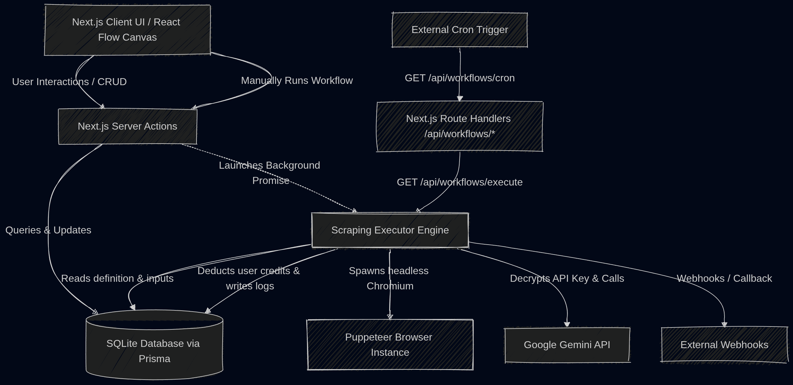

# 🚀 FlowCraft — AI-Powered No-Code Web Scraping Automation Tool

[](https://opensource.org/licenses/MIT)
[](https://nextjs.org/)
[](https://reactflow.dev/)
[](https://ai.google.dev/)
[](https://prisma.io/)

**FlowCraft** is an intelligent, visual web automation and scraping platform. It enables engineers, analysts, and teams to build resilient browser automation workflows using an intuitive drag-and-drop node graph canvas—paired with **Google Gemini AI** to dynamically parse, understand, and extract unstructured web data without brittle CSS/XPath selectors.

---

## 🖼️ Visual Demo

<div align="center">
  
</div>

---

## ✨ Key Highlights

- **Visual DAG Workflow Builder:** Design complex scraping logic with drag-and-drop nodes powered by `@xyflow/react`.
- **AI-Enhanced Extraction:** Harness Google Gemini 1.5 LLM reasoning to extract structured JSON from raw HTML, immune to website layout changes.
- **Headless Browser Execution:** Automated page navigation, typing, clicking, waiting, and scrolling via Puppeteer.
- **Scheduled Cron Triggers:** Publish workflows and automate recurring execution with cron-parser scheduling and telemetry logs.
- **Enterprise-Grade Security:** Encrypt sensitive third-party API keys and credentials with AES-256-CBC at rest.
- **Modular Data Delivery:** Stream extracted data directly to custom webhook endpoints or export as structured JSON.

---

## 🛠️ Technology Stack

| Layer | Technologies |
| :--- | :--- |
| **Frontend & UI** | Next.js 15 (App Router), React 18, Tailwind CSS, Radix UI, Lucide Icons, Framer Motion |
| **Workflow Canvas** | React Flow (`@xyflow/react`), TanStack React Query |
| **Automation Engine** | Puppeteer (Headless Chrome), Cheerio |
| **AI Integration** | Google Generative AI SDK (`@google/generative-ai` / Gemini 1.5 Flash) |
| **Database & ORM** | SQLite (Default for zero-config local run) / PostgreSQL / MySQL via Prisma ORM |
| **Authentication** | Custom stateless JWT with signed HTTP-only cookies (`jose`, `bcryptjs`) |
| **Scheduling** | `cron-parser`, `cronstrue` |

---

## 🚀 Quick Start Guide

Follow these steps to set up and run FlowCraft on your local machine for development.

### Prerequisites

- **Node.js:** `v18.x` or later (tested on Node v20+)
- **npm:** `v9.x` or later
- **Git:** Version control system

### Installation & Setup

1. **Clone the repository:**
   ```bash
   git clone https://github.com/rishab2211/AI-Powered-No-Code-Web-Scraping-Automation-tool.git
   cd AI-Powered-No-Code-Web-Scraping-Automation-tool
   ```

2. **Install dependencies:**
   ```bash
   npm install
   ```

3. **Configure environment variables:**
   Copy the example environment template:
   ```bash
   cp .env.example .env
   ```
   Generate secure secrets for JWT and encryption:
   ```env
   NEXT_PUBLIC_APP_URL="http://localhost:3000"
   DATABASE_URL="file:./dev.db"
   JWT_SECRET="your_custom_jwt_secret_key_minimum_32_characters"
   ENCRYPTION_SECRET_KEY="your_32_byte_aes_encryption_key_here"
   API_SECRET="your_internal_api_secret_key_here"
   GEMINI_API_KEY="your_google_gemini_api_key_here"
   ```

4. **Initialize database schema:**
   Push the Prisma schema to create the local SQLite database:
   ```bash
   npx prisma db push
   ```

5. **Start local development server:**
   ```bash
   npm run dev
   ```
   Open [http://localhost:3000](http://localhost:3000) in your browser.

---

## ⚙️ Core Architecture & Functionality

### 1. Visual Drag-and-Drop Node Canvas
Choreograph execution graphs with specialized node types:
- **Browser Nodes:** `Launch Browser`, `Navigate to URL`, `Scroll Page`.
- **Interaction Nodes:** `Click Element`, `Fill Input`, `Wait for Element`.
- **Extraction Nodes:** `Page to HTML`, `Extract Text via Selector`, `Extract Data with AI (Gemini)`.
- **Delivery Nodes:** `Deliver via Webhook`, `JSON Storage`.

### 2. High-Level Architecture
<div align="center">
  
</div>

---

## 🔒 Security & Credential Management

- All sensitive credentials (such as external Gemini API keys and basic auth passwords) are encrypted using AES-256-CBC with unique initialization vectors before writing to the database.
- Route handlers enforce strict JWT validation and ownership checks so users can only view, edit, and trigger their own automation pipelines.

---

## 📖 Comprehensive Documentation

For exhaustive architecture specifications, database schemas, API references, operational runbooks, and design decisions (ADR), refer to [`DOCUMENTATION.md`](DOCUMENTATION.md).

---

## 📄 License

This project is licensed under the [MIT License](LICENSE).
